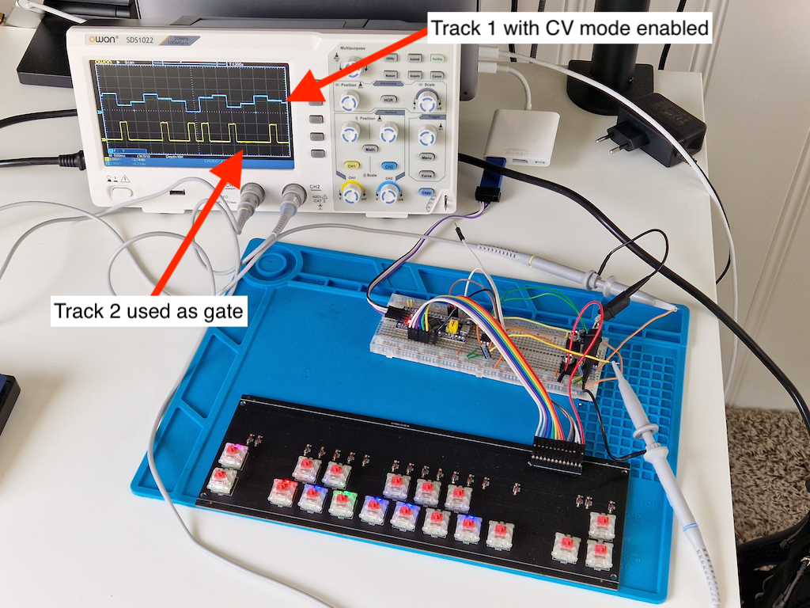
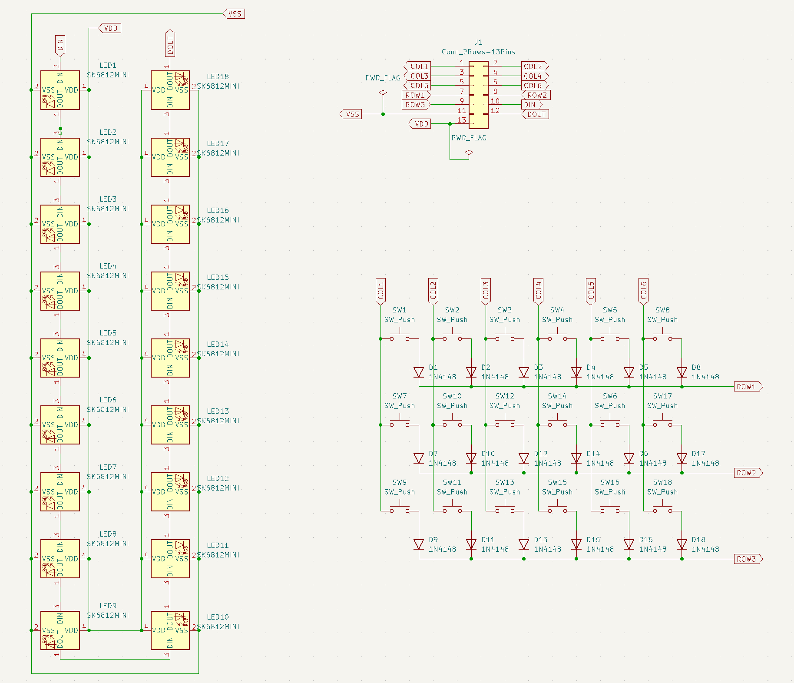

Music sequencer based on stm32 blue pill
========================================

> Modular music CV/Gate sequencer STM32F103C8 (blue pill) written in Rust.

## Overview



Keyboard is a custom PCB mounted with Cherry MX keys. It is based on the
following schematic:


## Pinout

Currently only 2 DACs in use:

```
STM32 PIN
PA0   COL0 (keypad)
PA1   COL1 (keypad)
PA2   COL2 (keypad)
PA3   COL3 (keypad)
PA4   COL4 (keypad)
PA5   COL5 (keypad)
PA8   ROW0 (keypad)
PA9   ROW1 (keypad)
PA10  ROW2 (keypad)
PB13  DAC1 & DAC2 SPI SCK (MCP4921)
PB15  DAC1 & DAC2 SPI MOSI (MCP4921)
PB12  DAC1 CS (MCP4921)
PB14  DAC2 CS (MCP4921)
PA6   LED data in (WS2812)
```

## Keyboard control

| Key           | Description
|---------------|--------------------------------------------------------------
| Shift+Fn1     | Switch between recording mode: step or note
| Shift+Fn2     | Clear steps
| Shift+Forward | Next track
| Shift+Back    | Previous track
| Fn1+Forward   | Toggle current track mode between CV and Gate
| Fn1+Step      | Select track number
| Fn2+Step      | Randomize CV or Gate with probability based on the selected step
| Forward       | Next octave
| Back          | Previous octave

## Development

###  Getting started

```bash
cargo flash --chip STM32F103C8
```

### Debugging

```bash
cargo embed
```
